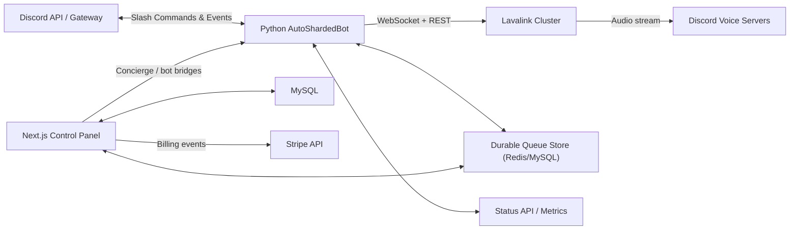

# VectoBeat Architecture & Data Flow

This document captures the production topology for the Discord bot, Next.js control panel, and supporting infrastructure. Keep it in sync with major runtime changes so operators and security reviewers have a canonical reference.

## High-Level Components

The canonical diagram is maintained in `docs/system_architecture.mmd`. Render a 4K PNG for docs/marketing or slides with:

```bash
npx -y @mermaid-js/mermaid-cli -i docs/system_architecture.mmd -o assets/images/architecture.png -w 3840 -H 2160 -b transparent
```

Key flows (summarised):



### Responsibilities

| Component | Responsibilities |
| --- | --- |
| **Python AutoShardedBot** | Slash commands, automation engine, concierge/success pod workflows, queue telemetry, observability feeds. |
| **Lavalink Cluster** | Audio transport (multi-node), cross-region routing, reconnection/failover. |
| **Next.js Control Panel** | User auth, subscription management, server settings editor, enterprise tooling (routing, account contacts, compliance desk). |
| **Durable Queue Store (Redis/MySQL)** | Queue snapshots, playlist persistence, telemetry caches with TTL + eviction. |
| **MySQL (Prisma)** | Control panel data (subscriptions, automation logs, concierge, custom API tokens). |
| **Status API** | Unified health payload for frontend widgets + routing reconcilers. |

## Data Flow Narrative

1. **User Interaction**
   - Guild admins authenticate in the control panel via Discord OAuth.
   - Settings edits (queue limits, routing preferences, API tokens) are persisted in MySQL and propagated to the bot via the `/api/bot/server-settings` bridge.
   - Enterprise widgets (success pod, account manager, routing panel) call dedicated APIs that coordinate between the control panel database and bot services.

2. **Bot Runtime**
   - The bot connects to Discord’s Gateway using AutoShardedBot for automatic scaling.
   - Playback requests are proxied to the Lavalink cluster. Regional preferences are enforced via the Regional Routing Service which consults persisted settings and falls back gracefully when nodes fail.
   - Automation/audit signals are written to MySQL through the `/api/bot/*` endpoints and mirrored in the control panel UI. Queue snapshots are pushed to `/api/bot/queue-sync` for dashboards and durable state.

3. **Observability**
   - Status API exposes ready-checked metrics (guild/queue counts, node health, assigned regions). Frontend widgets and routing reconciliations rely on this feed.
   - Prometheus-style `/metrics` on the bot plus health checks ensure Compose/Kubernetes can detect degraded state.

4. **External Services**
   - Stripe webhooks are consumed by the frontend API to provision plans.
   - Email + compliance exports leave via the SMTP integration (with rotating credentials defined in `.env`).

## Security Notes

- Secrets are injected through the shared `.env` and validated via `scripts/validate_env.py` before deployments.
- All cross-service traffic (control panel → bot) flows over authenticated HTTP endpoints guarded by bearer tokens.
- Data encryption keys are enforced for Prisma models containing sensitive payloads.

## Regional Failover & Health Checks

- **Regional pinning**: Growth+ customers can select US/EU/APAC nodes in the control panel. The bot clamps selections to the tier’s allowed regions, and automation logs disclose the effective region so support can verify routing.
- **Lavalink failover**:
  - Each region runs at least two Lavalink nodes behind Route 53 health checks. When a node fails, Route 53 drains DNS and the bot migrates players using the Redis-backed queue snapshot.
  - A scheduled worker (`scripts/lavalink-failover-check.mjs`) hits `/metrics` on every node, emits alarms, and updates the routing table used by the control panel’s Regional Routing panel.
- **Shard redundancy**:
  - AutoShardedBot runs with hot spares per region. Heartbeats are monitored; if a shard stalls, a spare assumes the shard ID and automation audit logs record the promotion.
  - Health dashboards in `docs/grafana` show shard/lavalink state for SREs.
- **Alarms & telemetry**:
  - Failover decisions and health-check failures flow into PagerDuty/Discord via webhooks.
  - `/api/control-panel/lavalink/nodes` surfaces status for customers, while the bot’s `regional_routing_service` enforces plan-aware routing.

## Keeping the Diagram Fresh

- Update `docs/system_architecture.mmd` whenever components are added/removed.
- Reference this doc from onboarding material (README, runbooks) so new engineers know where to look first.
