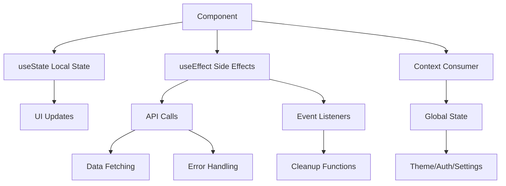
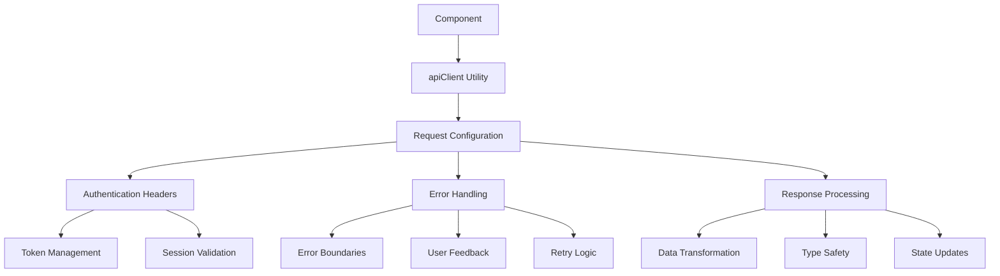
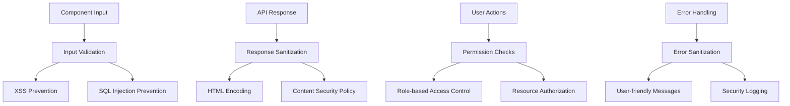

# Frontend Components Documentation Index

## Overview
This document provides a comprehensive index of all frontend components in the VectoBeat application, organized by category and functionality.

## Component Categories

### Core UI Components
```
components/ui/
├── button.tsx              # Primary button component with variants
├── input.tsx               # Form input with validation support
├── card.tsx                # Card container for content grouping
├── dialog.tsx              # Modal dialog with accessibility
├── form.tsx                # Form wrapper with validation
├── toast.tsx               # Notification system
├── spinner.tsx             # Loading indicators
├── badge.tsx               # Status and category badges
├── avatar.tsx              # User avatar with fallback
├── navigation-menu.tsx     # Responsive navigation component
├── table.tsx               # Data table with sorting/filtering
├── select.tsx              # Dropdown selection component
├── checkbox.tsx            # Checkbox with custom styling
├── switch.tsx              # Toggle switch component
├── tabs.tsx                # Tabbed content interface
├── accordion.tsx           # Collapsible content sections
├── alert.tsx               # Alert messages with variants
├── progress.tsx            # Progress indicators
├── separator.tsx           # Visual content separators
├── tooltip.tsx             # Contextual help tooltips
├── dropdown-menu.tsx       # Context menu component
├── command.tsx             # Command palette interface
├── calendar.tsx            # Date picker component
├── carousel.tsx            # Image/content carousel
├── chart.tsx               # Data visualization charts
├── collapsible.tsx         # Collapsible content
├── context-menu.tsx        # Right-click context menus
├── drawer.tsx              # Slide-out drawer component
├── hover-card.tsx          # Hover information cards
├── label.tsx               # Form labels with accessibility
├── menubar.tsx             # Application menu bar
├── pagination.tsx          # Data pagination controls
├── popover.tsx             # Popover content containers
├── radio-group.tsx         # Radio button groups
├── resizable.tsx           # Resizable panel groups
├── scroll-area.tsx         # Custom scrollable areas
├── sheet.tsx               # Bottom sheet component
├── sidebar.tsx             # Application sidebar
├── skeleton.tsx            # Loading placeholder
├── slider.tsx              # Range slider input
├── sonner.tsx              # Toast notification system
├── textarea.tsx            # Multi-line text input
├── toggle.tsx              # Toggle button component
├── toggle-group.tsx        # Grouped toggle buttons
├── use-mobile.tsx          # Mobile detection hook
├── use-toast.ts            # Toast notification hook
└── aspect-ratio.tsx        # Aspect ratio containers
```

### Layout Components
```
components/
├── header.tsx              # Application header with navigation
├── footer.tsx              # Application footer
├── navigation.tsx          # Main navigation component
├── theme-provider.tsx      # Theme context and management
└── 3d-logo.tsx            # Animated 3D logo component
```

### Feature Components
```
components/
├── cookie-banner.tsx       # GDPR-compliant cookie consent
├── plugin-marketplace.tsx  # Plugin discovery and management
├── support-desk.tsx        # Support ticket system
├── site-analytics.tsx      # Privacy-compliant analytics
├── stats.tsx              # Statistics display component
├── stats-control-panel.tsx # Statistics control interface
├── queue-sync-panel.tsx   # Queue synchronization interface
├── admin-plugin-manager.tsx # Plugin administration
├── features.tsx           # Feature showcase
├── hero.tsx               # Hero section component
├── cta.tsx                # Call-to-action component
├── home-metrics.tsx       # Homepage metrics display
├── home-plan-carousel.tsx # Pricing plan carousel
├── newsletter-signup.tsx  # Newsletter subscription
├── discord-widget.tsx     # Discord server widget
├── markdown-content.tsx   # Markdown content renderer
├── blog-comments.tsx      # Blog comment system
├── blog-reactions.tsx     # Blog reaction system
├── blog-session-bootstrap.tsx # Blog session management
├── blog-share-button.tsx  # Social sharing component
├── forum-actions.tsx      # Forum action buttons
├── forum-thread-browser.tsx # Forum thread navigation
├── forum-topic-starter.tsx # Forum topic creation
├── role-badge.tsx         # Discord role display
├── icons.tsx              # Icon component library
└── newsletter-signup.tsx  # Newsletter subscription form
```

### Settings Components
```
components/settings/
├── SettingsButton.tsx     # Settings trigger button
├── SettingsCard.tsx      # Settings card container
├── SettingsCheckbox.tsx  # Settings checkbox input
├── SettingsInput.tsx     # Settings text input
└── index.ts              # Settings component exports
```

## Component Architecture Patterns

### State Management Pattern


### API Integration Pattern


### Security Pattern


## Component Development Guidelines

### Code Quality Standards
- **TypeScript**: Strict TypeScript typing for all components
- **Error Boundaries**: Proper error boundary implementation
- **Accessibility**: WCAG 2.1 AA compliance
- **Performance**: React.memo and useMemo optimization
- **Testing**: Comprehensive unit and integration tests

### Design System Integration
- **Consistent Styling**: Tailwind CSS utility classes
- **Theme Support**: Light/dark theme compatibility
- **Responsive Design**: Mobile-first approach
- **Component Composition**: Reusable component patterns

### Security Best Practices
- **Input Validation**: Client and server-side validation
- **Output Encoding**: Context-appropriate encoding
- **Authentication**: Secure session management
- **Authorization**: Proper permission checks
- **Error Handling**: Secure error messages

## Component Documentation Structure

### Each Component Should Include:
1. **Overview**: Purpose and functionality
2. **Architecture**: Technical implementation details
3. **API Integration**: External service dependencies
4. **Security Considerations**: Security implications
5. **Error Handling**: Error scenarios and handling
6. **Performance**: Optimization strategies
7. **Testing**: Testing approach and coverage
8. **Future Enhancements**: Planned improvements

### Documentation Format:
- **Mermaid Diagrams**: Visual architecture representation
- **Code Examples**: Implementation examples
- **API Documentation**: Endpoint specifications
- **Security Guidelines**: Security best practices
- **Testing Strategies**: Test coverage and approaches

## Component Dependencies

### External Dependencies:
- **React 18**: Core framework
- **Next.js 14**: Full-stack framework
- **Tailwind CSS**: Styling framework
- **Lucide React**: Icon library
- **Radix UI**: Headless UI components
- **Framer Motion**: Animation library

### Internal Dependencies:
- **apiClient**: API communication utility
- **Theme Provider**: Theme management
- **Auth Context**: Authentication state
- **Settings Context**: User preferences
- **Error Boundaries**: Error handling

## Component Testing Strategy

### Unit Testing:
- **Component Rendering**: Render tests for all states
- **User Interaction**: Event handler testing
- **Props Validation**: Props type and validation testing
- **State Management**: State update testing

### Integration Testing:
- **API Integration**: API call and response handling
- **Context Integration**: Context provider integration
- **Router Integration**: Navigation and routing testing
- **Error Scenarios**: Error boundary and handling testing

### End-to-End Testing:
- **User Workflows**: Complete user journey testing
- **Cross-browser**: Browser compatibility testing
- **Accessibility**: Screen reader and keyboard navigation
- **Performance**: Load time and responsiveness testing

## Future Component Roadmap

### Planned Components:
- **Advanced Data Tables**: Enhanced table with sorting, filtering, pagination
- **Dashboard Widgets**: Configurable dashboard components
- **Chat Interface**: Real-time chat component
- **Video Player**: Custom video player with analytics
- **Audio Player**: Music/audio player with queue management
- **Calendar Scheduler**: Advanced scheduling component
- **File Manager**: File upload and management interface
- **Code Editor**: Syntax-highlighted code editor
- **Rich Text Editor**: WYSIWYG editor component
- **Data Visualization**: Advanced chart and graph components

### Component Library Goals:
- **Design System**: Comprehensive design system
- **Component Library**: Reusable component library
- **Documentation**: Interactive component documentation
- **Testing**: Automated testing infrastructure
- **Performance**: Performance monitoring and optimization